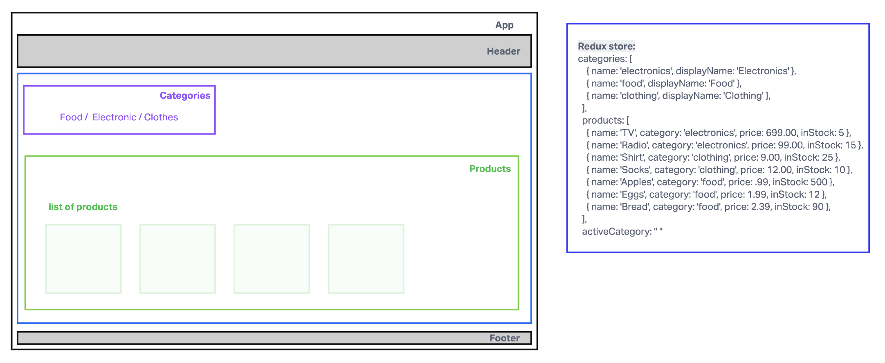
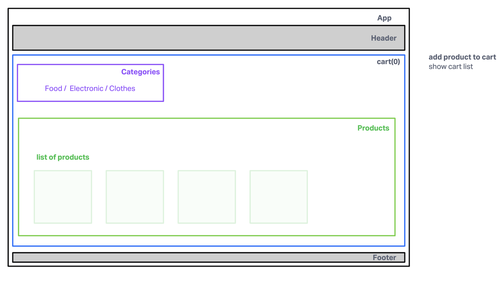

# LAB - Class 36

## Project: Store Front

### Author: Brenda Jow

### Problem Domain  

Create a virtual store using redux.

- user can see a list of available product categories in the store so that I can easily browse products.available product categories in the store so that I can easily browse products.
- user can choose a category and see a list of all available products matching that category.
- the  user interface should be clean, and easy to use so that user can shop the online store with confidence.

### Links and Resources

- [GitHub Actions ci/cd](https://github.com/brenda70904/storefront/actions)
- [Front-end server url]()

### Collaborators

### Setup

#### `.env` requirements (where applicable)

for now I have none and do not require one

#### How to initialize/run your application (where applicable)

- `npm start`

#### How to use your library (where applicable)

#### Features / Routes

- Feature One: Details of feature
- GET : `/hello` - specific route to hit

#### Tests

- How do you run tests?
- Any tests of note?
- Describe any tests that you did not complete, skipped, etc

#### UML

